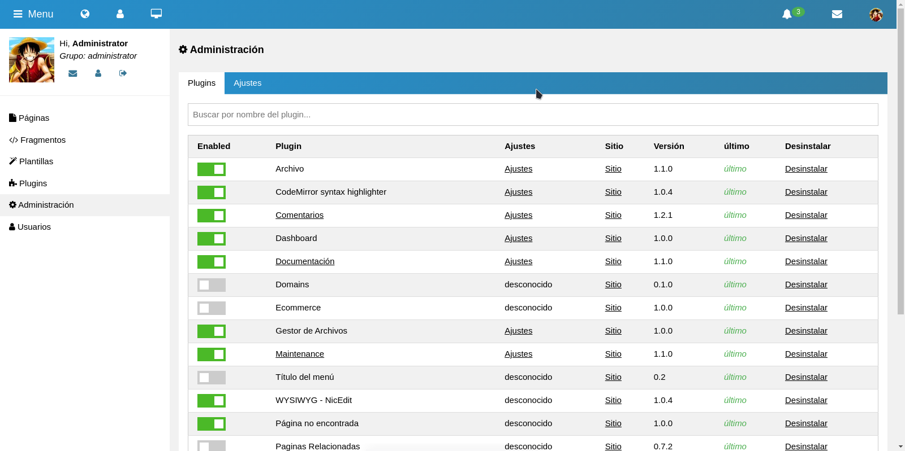

# :zap: Eteon MVC Plugins
Eteon allows you to host and build websites or web apps. Eteon contains plugin architecture and a template system, so you can customize any website to fit your business, blog, portfolio, or online store.

MVC (Model-View-Controller) is a pattern in software design commonly used to implement user interfaces, data, and controlling logic. It emphasizes a separation between the software's business logic and display. This "separation of concerns" provides for a better division of labor and improved maintenance.

The plugin system allows to wrap a Client and add some processing logic prior to and/or after sending the actual request or you can even start a completely new request. This gives you full control over what happens in your workflow.

### :bulb: Framework Installation:
https://github.com/aleksander-haugas/Eteon-MVC

### :checkered_flag: Plugin Installation:
Simple, place downloaded plugin files in the root of your webserver accesing via ftp. Make sure your plugin is unzipped, in the future also can upload  the package and zipped.

### :globe_with_meridians: Community Plugins (FREE)
Plugin Name | Database | JavaScript | PHP | Eteon MVC | Version | Status | Download
:------------ | :-------------| :-------------| :-------------| :-------------| :-------------| :-------------| :-------------
Keyboard shortcuts | :x: |  :heavy_check_mark: | :heavy_check_mark: | 0.9.4+ | 1.0.0 | Release | [Latest](https://github.com/aleksander-haugas/Eteon-MVC-Plugins/tree/main/eteon/plugins/shortcuts_control)
Skeleton | :x: |  :x: | :heavy_check_mark: | 0.9.4+ | 1.1.1 | Release | [Latest](https://github.com/aleksander-haugas/Eteon-MVC-Plugins/tree/main/eteon/plugins/skeleton)
Archive | :heavy_check_mark: |  :x: | :heavy_check_mark: | 0.9.4+ | 1.1.0 | Release | [Latest](https://github.com/aleksander-haugas/Eteon-MVC-Plugins/tree/main/eteon/plugins/archive)
Page not found | :x: |  :x: | :heavy_check_mark: | 0.9.4+ | 1.0.0 | Release | [Latest](https://github.com/aleksander-haugas/Eteon-MVC-Plugins/tree/main/eteon/plugins/page_not_found)
Syntax highlighting | :x: |  :heavy_check_mark: | :heavy_check_mark: | 0.9.4+ | 1.0.0 | Release | [Latest](https://github.com/aleksander-haugas/Eteon-MVC-Plugins/tree/main/eteon/plugins/syntax_highlighting)
Minify CSS & JS | :x: |  :x: | :heavy_check_mark: | 0.9.4+ | 0.0.1 | Release | [Latest](https://github.com/aleksander-haugas/Eteon-MVC-Plugins/tree/main/eteon/plugins/minify)
Dashboard | :heavy_check_mark: | :heavy_check_mark: | :heavy_check_mark: | 0.9.4+ | 0.0.1 | Release | [Latest](https://github.com/aleksander-haugas/Eteon-MVC-Plugins/tree/main/eteon/plugins/dashboard)
Comments | :heavy_check_mark: | :x: | :heavy_check_mark: | 0.9.4+ | 1.2.1 | Release | [Latest](https://github.com/aleksander-haugas/Eteon-MVC-Plugins/tree/main/eteon/plugins/comment)

- [x] Markdown (WYSIWYG) editor (release)
- [ ] Related pages (release)
- [x] Textedit (WYSIWYG) editor (release)
- [x] Maintencance (release)
- [x] Tags (release)
- [x] Blog / News / Articles (release)
- [x] Scala XLA payment gateway & wallet (dev)
- [x] Scala proxy server manager (Revision)

### :trophy: Premium Plugins
All the premium plugins can be download from the official website [Eteon MVC](https://eteon.airzox.com/addons), premium plugins have more updates and improvements, we also accept suggestions.
- [ ] ECDH Key Exchange tasks (revision)
- [x] Ecommerce platform
- [x] Private messaging system
- [x] Advanced SEO Managnament
- [x] Smart Cache
- [x] Image resizer & optimizer
- [x] Backup / Restore
- [x] Newsletters
- [x] Download manager
- [x] Advanced security tools
